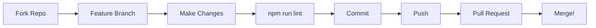

<div align="center">
  
  
  # ⚡ FLOWDO — FUTURISTIC PRODUCTIVITY OS
  
  <p align="center">
    <b>Your Personal Command Center for Time, Attention & Goals</b>
  </p>
  
  <p align="center">
    <a href="https://github.com/Shivansh-hub495/flowdo/blob/main/LICENSE">
      
    </a>
    <a href="https://github.com/Shivansh-hub495/flowdo">
      
    </a>
    <a href="https://react.dev">
      
    </a>
    <a href="https://supabase.com">
      
    </a>
    <a href="https://tailwindcss.com">
      
    </a>
    <a href="https://www.typescriptlang.org">
      
    </a>
  </p>
  
  <br />
  
  <p align="center">
    <b>✦ Open Source &nbsp;·&nbsp; Dark-First &nbsp;·&nbsp; Supabase-Powered &nbsp;·&nbsp; AI-Enhanced ✦</b>
  </p>
  
  <br />
  
  <blockquote>
    <i>"The key is not to prioritize what's on your schedule, but to schedule your priorities."</i><br />
    <b>— Stephen Covey</b>
  </blockquote>
</div>

<br />

---

<br />

<div align="center">
  
  ## THE GRAND UNIFICATION OF PRODUCTIVITY
  
  **FlowDo** fuses **task management**, **habit tracking**, **calendar planning**, **rich note-taking**, **Pomodoro focus sessions**, **AI copilot**, **gamification**, and **deep analytics** into a single, breathtaking interface — all wrapped in a **dark glassmorphism aesthetic** with purple-neon accents.
  
  Designed for **deep workers**, **creators**, and **executives** who demand more from their tools.
  
  <br />
  
  <table>
    <tr>
      <td align="center" width="200"><b>Tasks</b><br /><sub>Eisenhower Matrix</sub></td>
      <td align="center" width="200"><b>Calendar</b><br /><sub>Day & Month Views</sub></td>
      <td align="center" width="200"><b>Notes</b><br /><sub>Rich Text Editor</sub></td>
      <td align="center" width="200"><b>Pomodoro</b><br /><sub>Flip-Clock Timer</sub></td>
    </tr>
    <tr>
      <td align="center" width="200"><b>Habits</b><br /><sub>Streak Tracking</sub></td>
      <td align="center" width="200"><b>Targets</b><br /><sub>Time Horizons</sub></td>
      <td align="center" width="200"><b>AI Chat</b><br /><sub>Gemini Copilot</sub></td>
      <td align="center" width="200"><b>Stats</b><br /><sub>Analytics Engine</sub></td>
    </tr>
  </table>
  
</div>

<br />

---

<br />

<div align="center">
  
  ## FEATURES — EVERY TOOL A MASTERPIECE

</div>

<br />

### Eisenhower Matrix — *Task Management Reimagined*

Organize your world across **four strategic quadrants**:

| Quadrant | Action | Color |
|:---------|:-------|:------|
| **Urgent & Important** | **DO NOW** | `#ef4444` — Crisis Zone |
| **Important, Not Urgent** | **SCHEDULE** | `#f59e0b` — Growth Zone |
| **Urgent, Not Important** | **DELEGATE** | `#3b82f6` — Distraction Zone |
| **Neither** | **ELIMINATE** | `#6b7280` — Waste Zone |

Every task comes with:
- **Priority Spectrum** — Low → Medium → High → Critical
- **Status Pipeline** — Todo → In Progress → Blocked → Completed
- **Rich Metadata** — Due dates, estimated time, JSONB tags, inline notes
- **Smart Duplicate Detection** — Auto-cleans duplicates within a 60-second window
- **Gesture Controls** — Drag-to-complete on mobile

---

### Time-Based Targets — *Four Horizons of Planning*

| Horizon | Scope | Auto-Behavior |
|:--------|:------|:--------------|
| **Tomorrow** | Next 24h | Auto-migrates to full Tasks at midnight |
| **Week** | 7 days | Auto-cleaned on expiry |
| **Month** | 30 days | Auto-cleaned on expiry |
| **Year** | 365 days | Auto-cleaned on expiry |

**Migration Engine** — A sophisticated state machine that:
- Converts "tomorrow" targets into full-fledged tasks at day boundary
- Uses **triple-redundant safeguards** (localStorage + sessionStorage + DB query) to prevent duplicate creation
- Exposes global debugging utilities: `window.cleanupExpiredTargets()`, `window.forceTargetCleanup()`, `window.resetTargetMigration()`
- Runs emergency duplicate cleanup 2 seconds post-migration

---

### Habit Tracker — *Built for Consistency*

| Feature | Description |
|:--------|:------------|
| **Frequency Types** | Daily · Weekly · Monthly |
| **Visual Progress** | SMTWTFS grid with daily reset |
| **Streak Counter** | Consecutive days tracker |
| **Completion Rate** | Percentage-based analytics |
| **Monthly Journals** | Per-habit reflective entries |
| **Auto-Cleanup** | Boundary-aware data pruning |

---

### Calendar — *Your Temporal Canvas*

- **Dual View** — Month overview + Day granularity
- **6 Event Colors** — `#3b82f6` Blue · `#22c55e` Green · `#8b5cf6` Purple · `#ef4444` Red · `#f97316` Orange · `#ec4899` Pink
- **Rich Events** — Title, date, time range, location, attendees, all-day flag
- **Overlay System** — Tasks and targets rendered alongside calendar events in unified timeline

---

### Notes System — *Where Ideas Flow*

Powered by **ReactQuill** — a full rich-text editing engine:

| Capability | Details |
|:-----------|:--------|
| **Formatting** | Bold, Italic, Lists, Headers, Text Colors |
| **Media** | Images, Links, Video Embeds, Code Blocks |
| **Organization** | 5 color themes, tag-based filtering |
| **Deep Linking** | `linked_tasks` UUID array ties notes to tasks |
| **Routing** | Dedicated `/notes/new` and `/notes/:id` |

---

### Pomodoro Timer — *The Flip-Clock Experience*

- Launches a **standalone HTML flip-clock** (`Clock.html`) in its own window
- Passes **task context** via URL parameters: `?task=...&taskId=...&taskDescription=...&authToken=...`
- Persists every session to the `pomodoro_sessions` table
- Tracks **average focus time** across your history
- Session types: **Focus** & **Break**

---

### Vikram AI Copilot — *Your Intelligence Amplifier*

| Capability | Implementation |
|:-----------|:---------------|
| **LLM Engine** | Google Gemini via OpenAI-compatible SDK |
| **Web Search** | DuckDuckGo primary · Programmable Search fallback |
| **File Analysis** | Images (inline), PDFs (text extraction), `.txt`/`.md` |
| **Command Palette** | `/clone` · `/search` · `/page` · `/improve` |
| **Predictive Analytics** | Monte Carlo simulation (seed: 12345, decay: 0.95, 100 iterations, 7-day horizon) |
| **Context Injection** | Live calendar, task, and target data |
| **Diagnostics** | Built-in `testA4FConnection()` and `testA4FDirectFetch()` |

---

### Gamification — *21 Badges to Unlock*

| Badge Category | Example | Criteria |
|:---------------|:--------|:---------|
| **Focus** | Focus Master | 10 Pomodoros in a day |
| **Excellence** | Matrix Maestro | 90+ matrix score |
| **Consistency** | Streak Keeper | 7-day focus streak |
| **Intensity** | Deep Worker | 25+ hours focus / week |
| **Output** | Task Crusher | 50+ tasks completed / week |
| **Mastery** | Consistency King | Focus every day for a week |

Badges are stored with custom images in **Supabase Storage** (`achievement-images` bucket).

---

### Analytics Dashboard — *Data That Demands Action*

| Visualization | Type | Insight |
|:--------------|:-----|:--------|
| **Focus & Tasks Trend** | Composed Chart (Area + Bar + Line) | Multi-metric weekly view |
| **Eisenhower Distribution** | Donut Pie Chart + Progress Bars | Quadrant balance |
| **Task Flow** | Grouped Bar Chart | Created vs Completed |
| **Completion Rate** | Area Chart | Daily % trend |
| **Productivity Score** | SVG Circular Gauge | Weighted aggregate (0–100) |
| **Daily Breakdown** | 7-column heat bars | Per-day micro view |

---

<br />

<div align="center">
  
  ## ADVANCED ARCHITECTURAL FEATURES

</div>

### 🧠 AI Copilot Integration
> Core chat architecture designed to seamlessly stream LLM responses based on live user metrics. The AI assistant (Vikram) has context-aware access to your tasks, habits, calendar, and focus data — enabling it to provide hyper-personalized productivity advice, forecast completion timelines via Monte Carlo simulation, and execute commands through a natural language interface.

### 🔐 Token-Isolated Sub-Modules
> Secure JWT-based token handshakes passing persistent state to standalone engines (like the Pomodoro Flipping Clock). The `Clock.html` operates as a completely independent runtime — launched in a separate browser window — yet maintains authenticated context through cryptographically signed URL parameters, enabling autonomous session logging without re-authentication.

### 🗄️ Complex Data Persistence
> High-fidelity data layer powered by Supabase to track monthly performance analytics, streak counters, and nested routine matrices. The data architecture spans 10 interlinked PostgreSQL tables with real-time subscriptions, RLS policies per user, and storage buckets for user-generated content — all orchestrated through TanStack Query's optimistic update and cache invalidation engine.

### 🔄 Self-Healing Migration Engine
> The targets-to-tasks migration system implements a triple-redundant safeguard layer (localStorage + sessionStorage + database query) preventing duplicate creation across browser sessions, tab instances, and concurrent API calls. Expired targets are automatically detected and pruned on app bootstrap with emergency cleanup fallbacks.

### 📡 Realtime Synchronization
> Database changes on `targets` and `tasks` tables are published via Supabase Realtime, enabling instant UI updates across all connected clients without manual refresh.

<br />

---

<br />

<div align="center">
  
  ## THE BLUEPRINT — TECHNOLOGY STACK

</div>

| Layer | Technology | Badge |
|:------|:-----------|:------|
| **Build Tool** | Vite 5 + SWC |  |
| **Language** | TypeScript |  |
| **UI Framework** | React 18 |  |
| **Routing** | React Router 6 |  |
| **Styling** | Tailwind CSS 3 + Montserrat |  |
| **Components** | shadcn/ui (52 Radix primitives) |  |
| **State** | TanStack Query |  |
| **Backend** | Supabase (PostgreSQL + Auth + Storage) |  |
| **Charts** | Recharts |  |
| **Rich Text** | ReactQuill |  |
| **Animation** | Framer Motion |  |
| **Forms** | React Hook Form + Zod |  |
| **AI SDKs** | OpenAI SDK + Anthropic SDK |  |

---

<br />

<div align="center">
  
  ## PROJECT ANATOMY

</div>

```
flowdo/
├── public/                          # Static Assets
│   ├── Clock.html                   # Standalone Pomodoro Flip-Clock (3673 lines)
│   └── sounds/                      # Timer alerts
├── src/
│   ├── main.tsx                     # Application Entry Point
│   ├── App.tsx                      # Root Router Definitions
│   ├── index.css                    # Design System (glassmorphism, animations, scrollbars)
│   ├── contexts/
│   │   ├── AuthContext.tsx          # Auth State Provider (Supabase sessions)
│   │   └── CalendarContext.tsx      # Calendar Events Context
│   ├── integrations/supabase/
│   │   ├── client.ts               # Supabase Singleton
│   │   └── types.ts                # Full DB Typings (10 tables)
│   ├── lib/
│   │   ├── utils.ts                # cn() — clsx + tailwind-merge
│   │   ├── a4f-api.ts              # AI Chat Engine (Gemini + Search + Monte Carlo)
│   │   └── file-utils.ts           # Image/PDF/Text Processing
│   ├── hooks/
│   │   ├── useTasks.ts             # Task CRUD + Duplicate Cleanup
│   │   ├── useHabits.ts            # Habit CRUD + Streak Tracking
│   │   ├── useTargets.ts           # Target CRUD + Auto-Migration
│   │   ├── useNotes.ts             # Notes CRUD
│   │   ├── useCalendarEvents.ts    # Calendar CRUD
│   │   ├── useAchievements.ts      # Achievement CRUD + Image Upload
│   │   ├── usePomodoroSessions.ts  # Session Logging + Analytics
│   │   ├── useStatistics.ts        # Stats Engine + 21 Badges
│   │   └── use-mobile.tsx          # Mobile Detection + Swipe
│   ├── pages/
│   │   ├── Index.tsx               # Main Shell (12 views)
│   │   ├── Profile.tsx             # User Profile
│   │   └── auth/                   # Login · Signup · Forgot Password
│   ├── components/
│   │   ├── Navigation.tsx          # 11-Item Sidebar
│   │   ├── ProtectedRoute.tsx      # Auth Guard
│   │   ├── TodayView.tsx           # Daily Dashboard
│   │   ├── EisenhowerMatrix.tsx    # 4-Quadrant Board
│   │   ├── TargetsView.tsx         # Time Planner
│   │   ├── CalendarView.tsx        # Month / Day Views
│   │   ├── NotesView.tsx           # Notes List + Search
│   │   ├── NoteEditor.tsx          # Rich Text Editor
│   │   ├── PomodoroTimer.tsx       # Focus Launcher
│   │   ├── HabitsView.tsx          # Habit Tracker
│   │   ├── ChecklistView.tsx       # Daily Routines
│   │   ├── ChatView.tsx            # AI Interface
│   │   ├── StatsView.tsx           # Analytics Dashboard
│   │   ├── AchievementsView.tsx    # Badge Gallery
│   │   └── CleanupExpiredTargets.tsx # Auto-Cleanup
│   └── utils/
│       ├── migrateTargets.ts       # Migration Engine
│       ├── migrationSafeguards.ts  # Triple-Redundant Dupe Prevention
│       ├── taskCleanup.ts          # Duplicate Task Cleaner
│       └── habitCleanup.ts         # Month-Boundary Cleanup
├── supabase/
│   ├── config.toml                 # Project Config
│   └── migrations/                 # DB Migrations
├── restore_public_schema.sql       # Complete Schema Dump
├── package.json
├── vite.config.ts
├── tsconfig.json
├── tailwind.config.ts
└── eslint.config.js
```

---

<br />

<div align="center">
  
  ## DATA ARCHITECTURE — 10 TABLES, ONE ECOSYSTEM

</div>

| Table | Purpose | Highlights |
|:------|:--------|:-----------|
| `profiles` | User Identity | Auto-created via auth trigger |
| `tasks` | Eisenhower Tasks | Quadrant enum, JSONB tags, status workflow |
| `targets` | Time Horizons | Auto-migrate to tasks, auto-cleanup |
| `calendar_events` | Events | 6 colors, location, attendees |
| `habits` | Habit Definitions | Daily/Weekly/Monthly frequency |
| `habit_logs` | Daily Check-ins | Unique per (habit_id, log_date) |
| `habit_monthly_journals` | Reflections | Monthly journal entries |
| `pomodoro_sessions` | Focus Logs | Focus/Break types, duration tracking |
| `achievements` | Badges | Image upload to Supabase Storage |
| `notes` | Rich Text | Tags array, linked_tasks array, 5 colors |

**Storage Bucket:** `achievement-images` — Public per-user folder with RLS  
**Realtime:** `targets` + `tasks` — Live subscriptions for instant sync

---

<br />

<div align="center">
  
  ## LAUNCH SEQUENCE — GETTING STARTED

</div>

### Prerequisites

| Requirement | Version |
|:------------|:--------|
| **Node.js** | 18+ (via [nvm](https://github.com/nvm-sh/nvm)) |
| **npm** | 9+ |
| **Supabase Project** | Free tier works |

### Quick Start

```sh
# Clone the arsenal
git clone https://github.com/your-org/flowdo.git
cd flowdo

# Arm the dependencies
npm install

# Ignite the engine
npm run dev
```

Your command center awaits at **`http://localhost:8080`**

---

### Environment Configuration

The `.env` file (committed with safe defaults):

```env
VITE_SUPABASE_URL=https://your-project.supabase.co
VITE_SUPABASE_ANON_KEY=your-anon-key
VITE_GEMINI_API_KEY=your-gemini-api-key
```

Consumed via `import.meta.env` in:
- `src/integrations/supabase/client.ts`
- `src/lib/a4f-api.ts`
- `src/vite-env.d.ts` (typed declarations)

### Database Initialization

Execute migrations in order from `supabase/migrations/`:

```sh
1. 001_initial_auth_setup.sql    # Auth, profiles, tasks
2. 002_calendar_events.sql       # Calendar events
3. 003_notes_table.sql           # Notes
```

Or deploy the complete schema: `restore_public_schema.sql`

---

<br />

<div align="center">
  
  ## COMMAND CENTER — SCRIPTS

</div>

| Command | Script | Action |
|:--------|:-------|:-------|
| `npm run dev` | `vite` | Ignite dev server (HMR, port 8080) |
| `npm run build` | `vite build` | Production bundle |
| `npm run build:dev` | `vite build --mode development` | Dev build |
| `npm run preview` | `vite preview` | Preview build output |
| `npm run lint` | `eslint .` | Lint all source |

---

<br />

<div align="center">
  
  ## THE DESIGN SYSTEM — DARK FORGED

</div>

### Theme Philosophy

```
Primary:     hsl(263, 70%, 50%)  — Royal Purple
Secondary:   hsl(240, 3.7%, 15.9%) — Deep Slate
Background:  hsl(240, 10%, 3.9%)  — Near Black
Accent:      hsl(263, 70%, 50%)  — Same Purple, mode-aware
```

- **Dark-first** with full CSS variable theming
- **Light mode** via `.light` class toggle
- **Glassmorphism** — `backdrop-filter: blur(20px)` on every card
- **Purple neon glow** on active elements

### Custom Animations

| Name | Effect |
|:-----|:-------|
| `glow` | Pulsing neon ring |
| `shimmer` | Loading sweep |
| `float` | Suspended motion |
| `pulse-subtle` | Gentle heartbeat |
| `countdown` | Timer urgency |
| `meteor` | Cosmic background |

### CSS Utilities

| Utility | Function |
|:--------|:---------|
| `.glass` | Glassmorphism card |
| `.glow` | Purple neon shadow |
| `.gradient-border` | Gradient edge overlay |
| `.flip-card` | 3D perspective transform |
| `.auth-glass` | Enhanced auth backdrop |
| `.gradient-text` | Animated text shimmer |
| `.sidebar-scrollbar` | Custom purple scrollbar |

---

<br />

<div align="center">
  
  ## CONTRIBUTING — BUILD WITH US

</div>



1. **Fork** the repository
2. **Branch**: `git checkout -b feat/your-feature`
3. **Code** with style:
   - TypeScript functional components with hooks
   - Tailwind classes (via `cn()` utility)
   - shadcn/ui patterns
   - Framer Motion for animations
   - Explicit import paths (no barrel exports)
4. **Lint**: `npm run lint`
5. **Commit** with descriptive message
6. **Push** and open a **Pull Request**

---

<br />

<div align="center">
  
  ## ROADMAP — THE FUTURE AWAITS

</div>

- [ ] **Test Suite** — Unit & integration tests
- [ ] **Mobile App** — React Native client
- [ ] **Offline Mode** — PWA with service workers
- [ ] **Collaboration** — Real-time task boards
- [ ] **Notifications** — Email & push reminders
- [ ] **Public API** — RESTful endpoints
- [ ] **Plugin System** — Custom extensions
- [ ] **Theme Toggle** — Dark/Light system
- [ ] **Drag & Drop** — Task reordering
- [ ] **Recurring Tasks** — Scheduled repetition

---

<br />

<div align="center">
  
  ## LICENSE
  
  <br />
  
  <a href="https://github.com/Shivansh-hub495/flowdo/blob/main/LICENSE">
    
  </a>
  
  <br /><br />
  
  **FlowDo** — Built with React, Supabase & TypeScript<br />
  *Designed for focus, clarity, and getting things done.*
  
  <br /><br />
  
  
  
</div>
